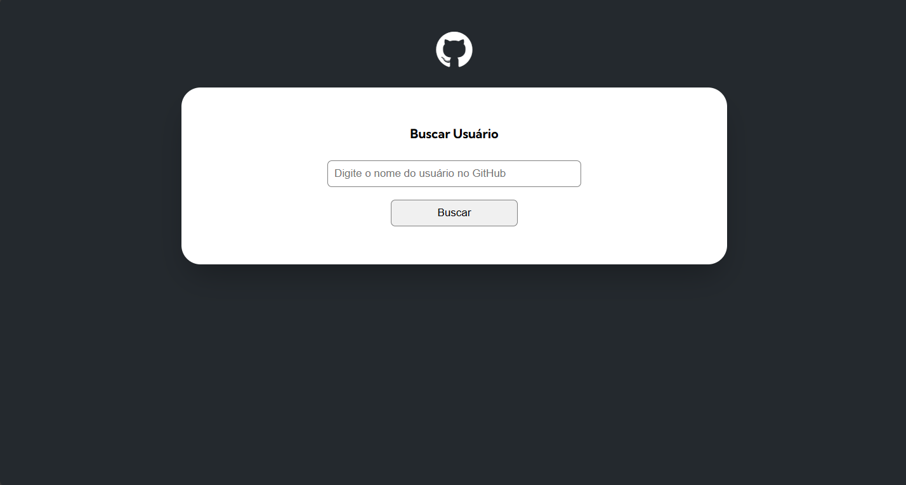
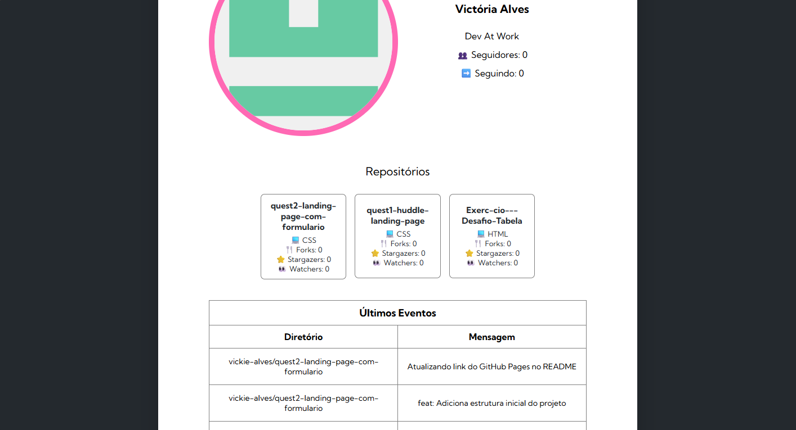
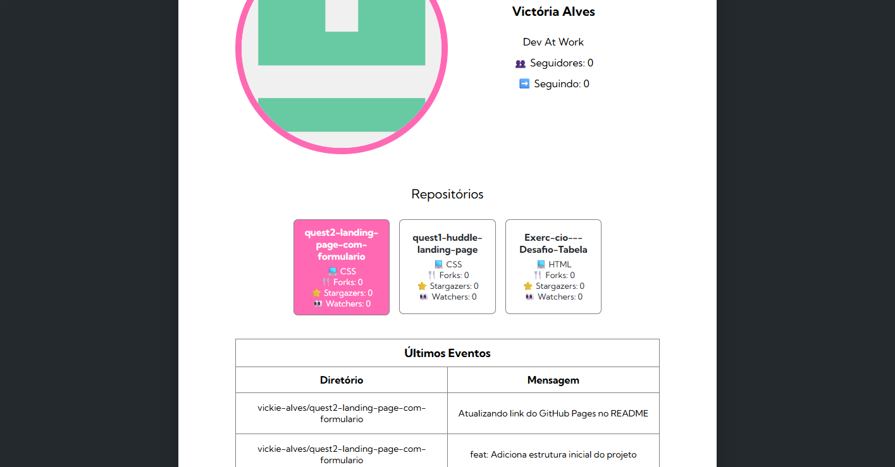
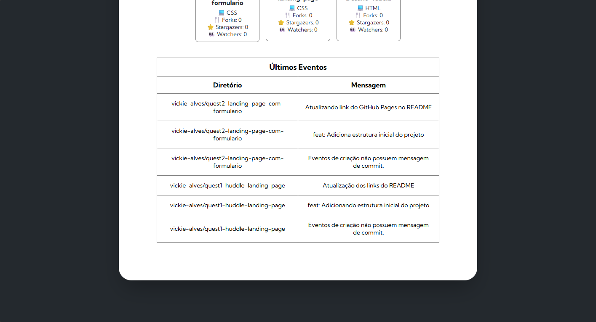
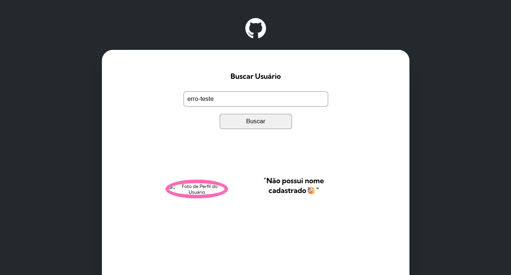

## Quest #3 - Buscador de Usuários do Github - Fetch API (Reimaginado)

Este projeto é um desafio proposto pelo curso DevQuest. A tarefa consistia em continuar o *layout* de um buscador de *desenvolvedores* do *GitHub* usando *CSS* e *JavaScript* avançado para realizar requisições de *API* (*fetch*) e inserir os dados coletados no *DOM* para exibição no *HTML*, seguindo o design pré-definido. Esta versão do projeto reimagina algumas estilizações e estruturações da página, diferentemente do conteúdo inicial.

## Objetivo do Desafio

Foi proposta a continuação do design apresentado em aula, organizando a visualização das informações buscadas pelo usuário através de requisições à *API* do *GitHub*, exibindo mensagens de erro no console e uma tela padrão de dados não encontrados caso alguma parte do código falhe, evitando bugs visuais.

* **Disposição clara dos dados recebidos:** Permitindo a visualização dos dados de perfil, acesso aos repositórios dos usuários através de botões e uma tabela com os últimos eventos realizados pelo desenvolvedor, com uma apresentação atraente e adaptativa a diferentes resoluções.
* **Lógica de JavaScript:** Estruturação sólida das requisições de dados, aguardando o recebimento das informações simultaneamente e construindo o *layout* de exibição do conteúdo apenas quando tudo recebido corretamente.
* **Fluxo controlado de erros:** Executando as requisições de dados dentro de blocos de *try* e *catch* para que toda falha na operação gere um retorno de status no console para *debugging* e um layout padrão para o usuário identificar que o pedido foi mal sucedido.
* **CSS Avançado:** Aplicação de ferramentas como *Flexbox*, variáveis de cor para consistência identitária da página e media queries para adaptar a visualização para variadas resoluções.

## Tecnologias Utilizadas

| Tecnologia | Finalidade |
| :---: | :---: |
| **HTML5** | Estruturação semântica da página. |
| **CSS3** | Estilização, *Flexbox* e *media queries*. |
| **ECMAScript 2025 (JavaScript)** | Lógica de requisições *fetch*, construção do *layout* com os dados e exibição das informações em tela. |
| **Google Fonts** | Importação da fonte **Kumbh Sans**. |
| **jsDelivr*** | Importação do ícone do **GitHub**. |

## Screenshots

| Buscador (Inicial) | Buscador (Resultado Perfil) | Buscador (Resultado Repositório)
| :---: | :---: | :---: |
|  |  |  |
| **Buscador (Destaque Repositório)** | **Buscador (Resultado Eventos)** | **Buscador (Não Encontrado)** |
|  |  |  |

## Links

* **Live Site URL:** https://vickie-alves.github.io/quest3-buscador-de-perfis-GitHub-usando-Fetch-API-reimaginado/

## Autor

* **GitHub:** [Victoria Alves](https://github.com/vickie-alves)
